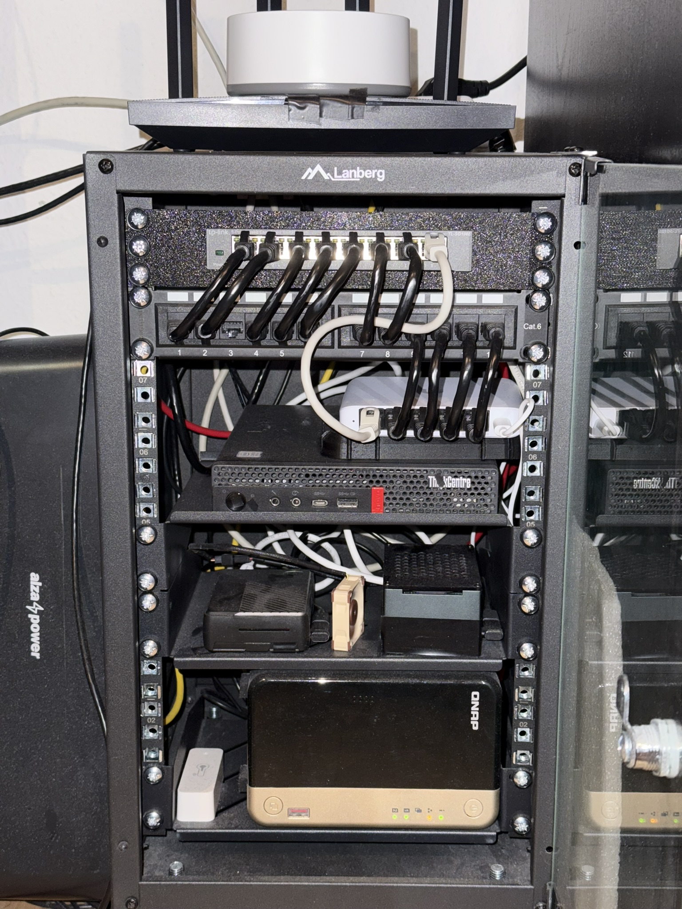
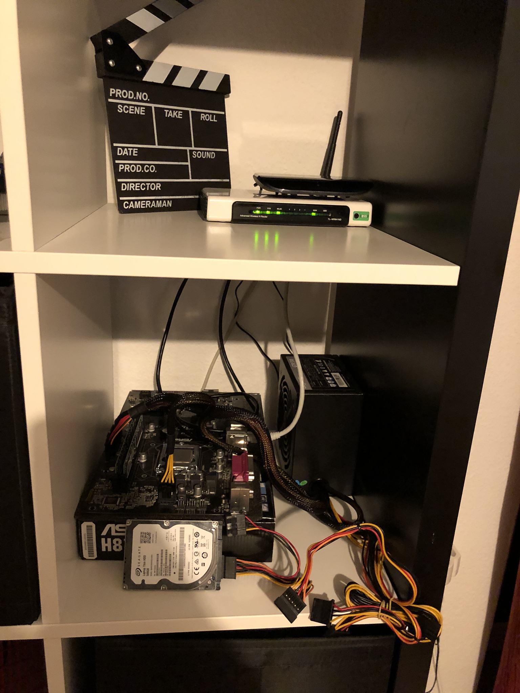
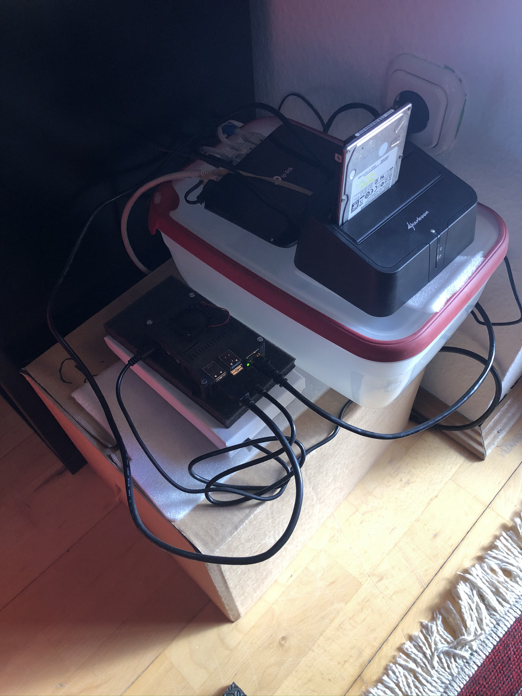
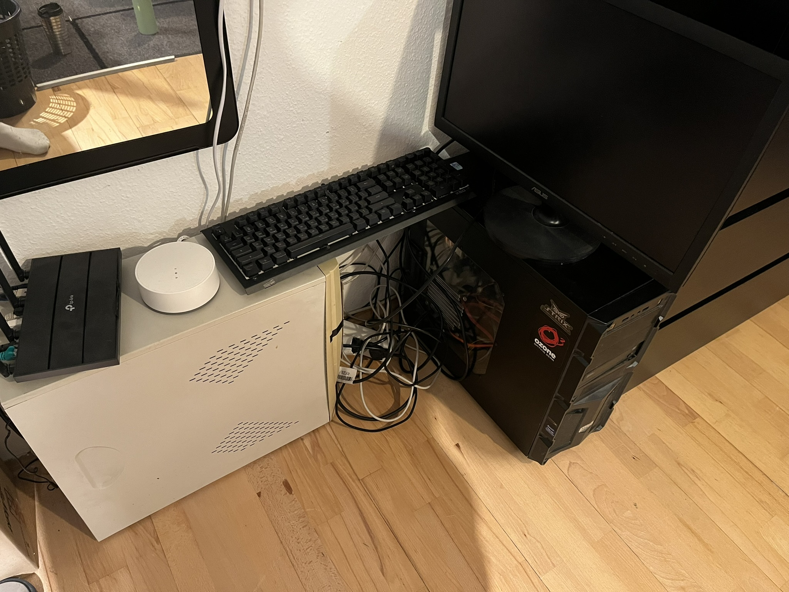
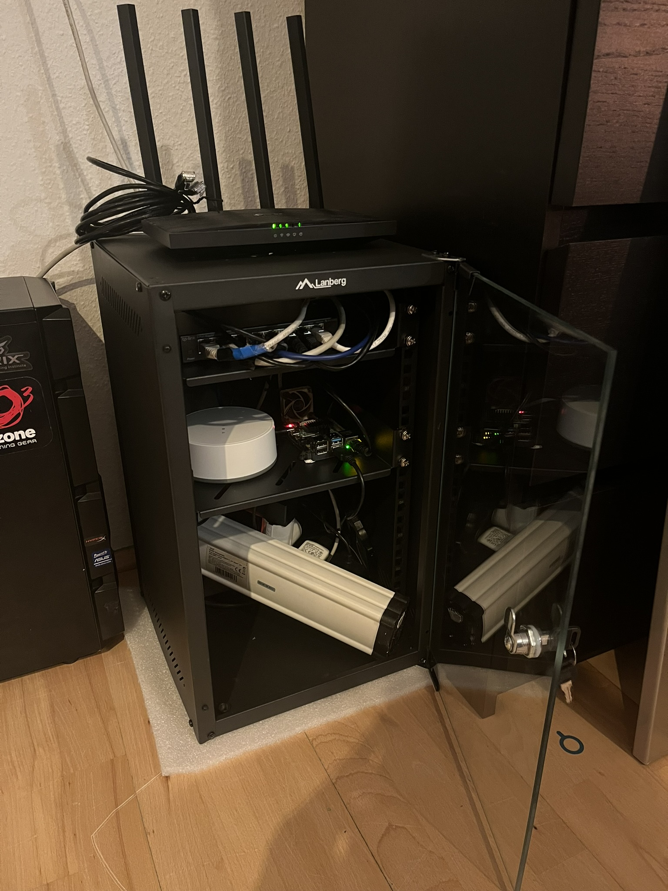
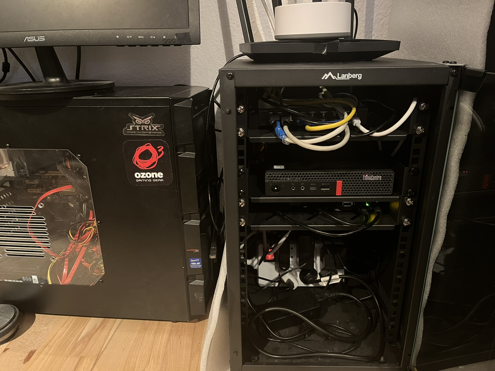
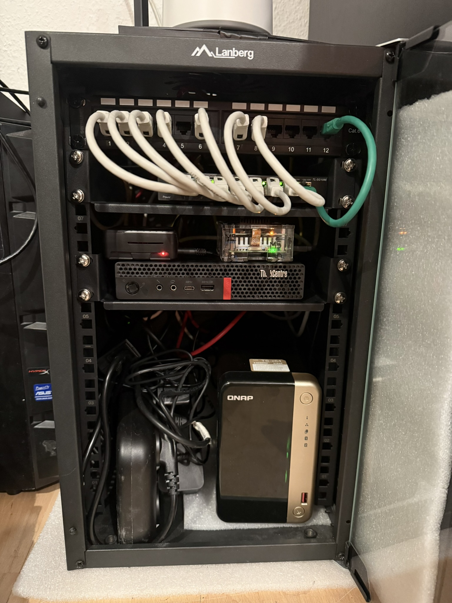

# Home Lab Infrastructure

This repository documents the hardware setup and network infrastructure of my home lab. The lab consists of several purpose-driven devices, each playing a specific role in automation, virtualization, media serving, and data storage.

---

## 🖥️ Devices & Roles

### 🔹 NovaZero *(Raspberry Pi Zero 2 W)*

- **Purpose**: Runs a **Wake-on-LAN server status** and **open-port report** website

### 🔹 Nova5 *(Raspberry Pi 5 – 8GB)*

- Fan + SSD HAT  
- 512GB SSD  
- **Purpose**: Automation tasks and web scraping operations

### 🔹 Nova4 *(Raspberry Pi 4 – 4GB)*

- Case + 128GB SD card  
- **Purpose**: Running **Home Assistant** for smart home management

### 🔹 FluxMini *(Lenovo M720q Tiny)*

- Intel Core i5-8500T  
- 32GB RAM  
- 256GB NVMe SSD  
- 512GB SATA SSD  
- **Purpose**: Running **Proxmox VE**  
  - Hosts both Windows and Linux virtual machines  
  - Dedicated to **VM testing / experimentation**

### 🔹 FluxNas *(QNAP TS-264-8G)*

- Intel Celeron N5095  
- 8GB RAM  
- **SSD Cache**: Crucial P3 M.2 500GB  
- **Storage**: 2 × 4TB HDD  
- **Purpose**:  
  - Primary **data storage**  
  - Runs **Plex Media Server**  
  - Hosts a few lightweight **Linux VMs** for auxiliary tasks

### 🔹 FluxZima *(ZimaBlade 3760 – SBC module)*

- **RAM**: 8GB *(upgraded)*  
- **Storage**: 2 × 2TB HDD  
- **Purpose**:  
  - **Torrent** automation (automatic downloads)  
  - Stores **most of the media files used by Plex**

---

## 📦 Network & Rack Equipment

- **Server Rack**: Lanberg Rack 10" 9U  
- **Mounted Shelf**  
- **Switch 1**: TP-LINK TL-SG108E (8-Port Gigabit Smart Switch)  
- **Switch 2**: Ubiquiti UniFi Flex Mini (2.5G)  
- **Patch Panel**: Manhattan CAT6 UTP, 12 Ports, 10", 1U  
- **Access Point**: TP-Link Archer C6 (V3.2)  

---

## 🛠️ Usage Overview

| Device     | Functionality                                              |
|------------|-------------------------------------------------------------|
| NovaZero   | Wake-on-LAN server status + open-port report website        |
| Nova5      | Automation scripts, scrapers                                |
| Nova4      | Home Assistant instance                                     |
| FluxMini   | Virtualization (Proxmox), VM testing / experimentation       |
| FluxNas    | Data storage, light VM hosting, Plex Media Server            |
| FluxZima   | Torrent automation, primary Plex media file storage location |

---

## 🚀 Goals & Use Cases

- Self-hosted services with containers and VMs  
- Smart home automation (Home Assistant)  
- Web scraping and background automation  
- Personal media server (Plex)  
- Automated media acquisition (torrent automation)  
- Redundant and scalable file storage  
- Experimentation with virtualization and networking  

---

## 📸 Photos & Diagrams

---
## history

| **2019-01** | **2020-04** |
|:--:|:--:|
|  |  |

| **2023-12** | **2024-01** |
|:--:|:--:|
|  |  |

| **2024-05** | **2024-10** |
|:--:|:--:|
|  |  |

| **2025-07** |  |
|:--:|:--:|
|  |  |

---

## 📅 Last Updated

**February 2026**
